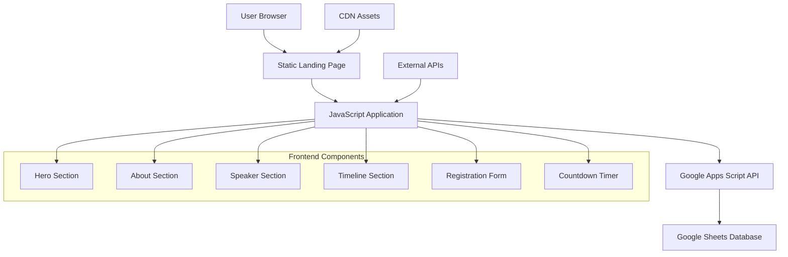

# Design Document

## Overview

The HacktheGab landing page will be a single-page application (SPA) built with modern web technologies, featuring a cybersecurity-themed design that converts visitors into event registrants. The page will use a dark theme with accent colors (cyan/blue) to reflect the cybersecurity domain, incorporating circuit-board patterns and modern animations to create an engaging user experience.

The architecture follows a client-server model with a static frontend and serverless backend integration via Google Apps Script for data persistence.

## Architecture

### High-Level Architecture



### Technology Stack

**Frontend:**
- HTML5 with semantic markup
- Tailwind CSS for styling and responsive design
- Vanilla JavaScript for interactivity and form handling
- AOS.js for scroll animations
- Font Awesome for icons

**Backend:**
- Google Apps Script for serverless form processing
- Google Sheets as the database for registration data

**Assets:**
- Local image assets (AEGIS CLUB.png, AMITYLOGO.jpeg, SATVIK.jpeg)
- Optimized images for different screen densities

## Components and Interfaces

### 1. Hero Section Component

**Purpose:** Primary conversion area with event branding and CTA

**Design Elements:**
- Full viewport height with cybersecurity-themed background
- Animated circuit board pattern overlay
- Centered content with event title, tagline, and CTA button
- Logos positioned strategically (top corners or header area)
- Countdown timer prominently displayed

**Layout Structure:**
```
[Logo: Amity]                    [Logo: Aegis Club]
                [Event Title]
              [Tagline]
            [Countdown Timer]
           [Register Now CTA]
```

**Styling:**
- Dark gradient background (#0a0a0a to #1a1a2e)
- Cyan accent color (#00d4ff) for highlights
- Typography: Modern sans-serif (Inter or similar)
- Animated background particles/circuits

### 2. About Section Component

**Purpose:** Inform visitors about event value and target audience

**Content Structure:**
- Brief seminar description (2-3 sentences)
- "What You'll Learn" bullet points
- Target audience badges/tags
- Visual icons representing cybersecurity concepts

**Layout:**
- Two-column layout on desktop, single column on mobile
- Left: Text content, Right: Visual elements/icons
- Cards or sections for different information types

### 3. Speaker Section Component

**Purpose:** Build credibility through speaker credentials

**Design Elements:**
- Professional speaker photo (SATVIK.jpeg)
- Name, title, and credentials
- Social media links (LinkedIn, YouTube)
- Brief bio or expertise highlights

**Layout:**
- Centered card design with photo and information
- Social links as styled buttons
- Professional color scheme

### 4. Timeline/Schedule Component

**Purpose:** Display detailed event agenda

**Design Elements:**
- Timeline visualization or structured table
- Time slots with corresponding activities
- Visual separators between sessions
- Hover effects for interactivity

**Data Structure:**
```javascript
const schedule = [
  { time: "10:00 AM", activity: "Opening & Intro" },
  { time: "10:15 AM", activity: "Satvik Sharma Talk - Basics of Hygiene" },
  { time: "11:00 AM", activity: "Threat Demo & Blue Teaming Basics" },
  { time: "11:30 AM", activity: "Live Tool Demos (Nmap, Burp Suite, etc.)" },
  { time: "12:15 PM", activity: "Career in Cybersecurity - Q&A" },
  { time: "12:45 PM", activity: "Registration Certificate Distribution" }
];
```

### 5. Registration Form Component

**Purpose:** Capture attendee information for event registration

**Form Fields:**
- Full Name (required, text input)
- Email (required, email validation)
- College/Organization (optional, text input)
- Submit button with loading states

**Validation Rules:**
- Name: Required, minimum 2 characters
- Email: Required, valid email format
- Real-time validation feedback
- Form submission handling with success/error states

**UI States:**
- Default state
- Loading state (during submission)
- Success state (registration confirmed)
- Error state (submission failed)

### 6. Countdown Timer Component

**Purpose:** Create urgency and show time remaining

**Functionality:**
- Real-time countdown to August 10, 2025, 10:00 AM
- Display format: "Xd Xh Xm Xs"
- Auto-update every second
- Handle expired event state

**Implementation:**
```javascript
class CountdownTimer {
  constructor(targetDate, elementId) {
    this.targetDate = new Date(targetDate).getTime();
    this.element = document.getElementById(elementId);
    this.start();
  }
  
  update() {
    const now = new Date().getTime();
    const distance = this.targetDate - now;
    // Calculate and display time units
  }
  
  start() {
    this.interval = setInterval(() => this.update(), 1000);
  }
}
```

## Data Models

### Registration Data Model

```javascript
interface RegistrationData {
  timestamp: Date;
  name: string;
  email: string;
  college?: string;
  status: 'pending' | 'confirmed' | 'failed';
}
```

### Form Validation Model

```javascript
interface ValidationResult {
  isValid: boolean;
  errors: {
    name?: string;
    email?: string;
  };
}
```

### API Response Model

```javascript
interface APIResponse {
  success: boolean;
  message: string;
  data?: any;
  error?: string;
}
```

## Error Handling

### Frontend Error Handling

**Form Validation Errors:**
- Display inline error messages below form fields
- Use red color (#ff4444) for error states
- Clear errors when user starts typing

**Network Errors:**
- Show user-friendly error messages
- Provide retry functionality
- Graceful degradation for offline scenarios

**JavaScript Errors:**
- Implement try-catch blocks around critical functions
- Log errors to console for debugging
- Fallback UI states for broken components

### Backend Error Handling

**Google Apps Script Error Handling:**
```javascript
function doPost(e) {
  try {
    // Process registration data
    var sheet = SpreadsheetApp.openById("SHEET_ID").getSheetByName("Responses");
    sheet.appendRow([new Date(), e.parameter.name, e.parameter.email, e.parameter.college]);
    
    return ContentService
      .createTextOutput(JSON.stringify({success: true, message: "Registration successful"}))
      .setMimeType(ContentService.MimeType.JSON);
  } catch (error) {
    return ContentService
      .createTextOutput(JSON.stringify({success: false, error: error.toString()}))
      .setMimeType(ContentService.MimeType.JSON);
  }
}
```

## Testing Strategy

### Unit Testing
- Form validation functions
- Countdown timer calculations
- Data formatting utilities
- API request/response handling

### Integration Testing
- Form submission to Google Apps Script
- End-to-end registration flow
- Cross-browser compatibility testing
- Mobile device testing

### User Acceptance Testing
- Registration flow completion
- Visual design validation
- Performance testing on various devices
- Accessibility compliance testing

### Performance Testing
- Page load speed optimization
- Image optimization and lazy loading
- JavaScript bundle size optimization
- Mobile performance validation

## Responsive Design Strategy

### Breakpoints
- Mobile: 320px - 768px
- Tablet: 768px - 1024px
- Desktop: 1024px+

### Mobile-First Approach
- Base styles for mobile devices
- Progressive enhancement for larger screens
- Touch-friendly interactive elements
- Optimized image sizes for different screen densities

### Layout Adaptations
- Hero section: Stack elements vertically on mobile
- About section: Single column layout on mobile
- Timeline: Vertical timeline on mobile, horizontal on desktop
- Registration form: Full-width on mobile, centered card on desktop

## SEO and Social Media Optimization

### Meta Tags
```html
<meta name="description" content="Join HacktheGab: Cyber Hygiene to Cyber Defense seminar with Satvik Sharma. Learn cybersecurity basics, threat detection, and career opportunities.">
<meta name="keywords" content="cybersecurity, seminar, HacktheGab, Satvik Sharma, cyber defense, Amity University">

<!-- Open Graph -->
<meta property="og:title" content="HacktheGab: Cyber Hygiene to Cyber Defense">
<meta property="og:description" content="From Basics to the Battlefield - Join our cybersecurity seminar">
<meta property="og:image" content="./social-preview.jpg">
<meta property="og:type" content="event">

<!-- Twitter Card -->
<meta name="twitter:card" content="summary_large_image">
<meta name="twitter:title" content="HacktheGab: Cyber Hygiene to Cyber Defense">
<meta name="twitter:description" content="From Basics to the Battlefield - Join our cybersecurity seminar">
<meta name="twitter:image" content="./social-preview.jpg">
```

### Performance Optimization
- Minified CSS and JavaScript
- Optimized images with appropriate formats (WebP with fallbacks)
- Lazy loading for non-critical images
- Critical CSS inlined
- Font loading optimization

This design provides a comprehensive foundation for building a modern, conversion-focused landing page that meets all the specified requirements while maintaining professional aesthetics and optimal user experience.